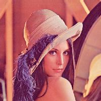
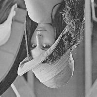
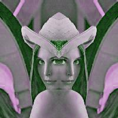
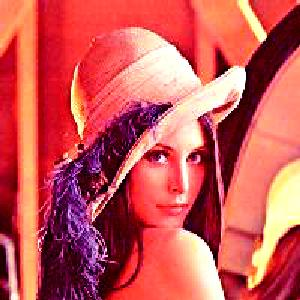

# SIMPLE IMAGE EDITOR

Simple image editor (*simge*) is a program which provides images editing, manipulating and filtering. Program has been written in C language. However for image compression and decompression purposes some python code has been used. 

## Requirements
Program requires incoming dependencies:
 - linux operating system with gcc compiler (e.g. windows subsytem for linux),
 - python 3.8 with python3.8-dev package installed,
 - python Pillow library.

## Instalation
To install *simge* on Debian based distro run `install.sh` file with super-user privilages. If you want install dependencies manually (e.g. in python venv) run `compile.sh` script which only compiles *simge* - then install remaining dependencies manually.

# Usage

General command structure to run *simge* is `simge [options]... <file_in> <file_out>`. \
Output file extension must be specified to let simge know which image compression alghoritm use for output file. Running *simge* without options decompress input file and then compress data with compression alghoritm specified by extension into output file.

## Options

Options order is relevant. For example running *simge* with options `-r180 -p100,100,200,200` (rotate then crop) is not equivalent to running program with options `-p100,100,200,200 -r180` (crop then rotate).

| Option | Argument | Argument values | Decription | 
|--|--|--|--|
| --rotate (-r) | angle | {90, 180, 270} | Rotates image by angle. |
| --mirror (-m) | axis | {x, y} | Mirrors image to the axis. |
| --symmetric (-s) | side | {l, u, r, d} | Reflects image side symmetric. |
| --resize (-n) | dimension| 'new_width[,new_height]' | Resizes image. Resizes both sides with new_width if new_height is not given. |
| --crop (-p) | coordinates| 'start_x,start_y,final_x,final_y' | Crops image. |
| --binary (-b) | method | {n, r} | Converts image to binary. |
| --grayscale (-g) | - | - | Converts image to grayscale. |
| --sepiascale (-e) | - | - | Converts image to sepiascale. |
| --switch (-w) | channels | '---', where each '-' in {R, G, B, 0} | Switch or disable image's RGB channels. |
| --lightness (-l) | value | <-255, 255> | Sets image lightness. |
| --contrast (-c) | value | <0, 360> | Sets image contrast. |

Some of options argument's values has other equivalent values (e.g. {l, u, r, d} == {left, up, right, down}). Using that values is supported by *simge*. All of these values can be found in *main.c* file.

# Examples
Input image:\

| Command | Output | 
|--|--|
| `simge -r180 -g ex/lenna.jpg ex/lenna_r180_g.jpg` |  |
| `simge -sr -wGBR ex/lenna.jpg ex/lenna_sr_wgbr.jpg` |  |
| `simge -c250 -n300 ex/lenna.jpg ex/lenna_c250_n300.jpg` |  |
| `simge -l-100 -p20,20,150,200 ex/lenna.jpg ex/lenna_l-100_p20,20,150,200.jpg` |  |